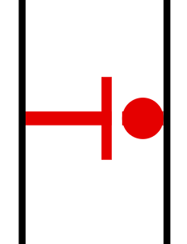
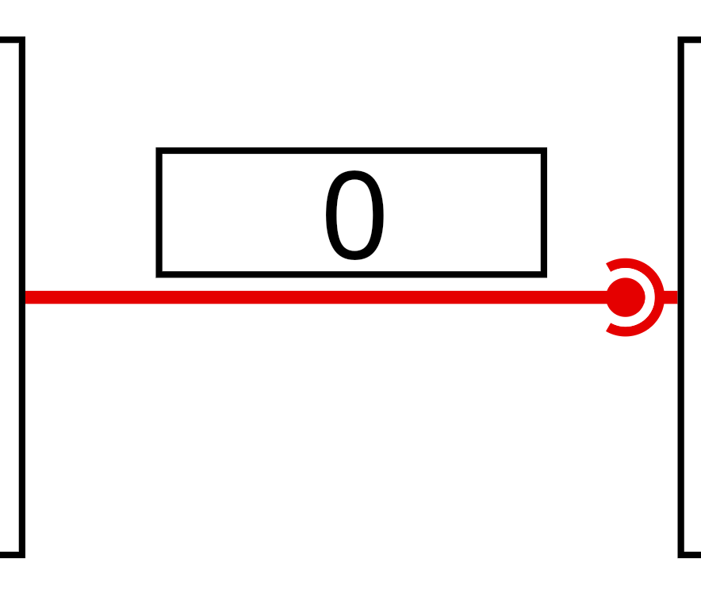

<!-- ---
title: Push channels and pull channels
layout: default
nav_order: 10
parent: Internals
nav_exclude: true # hidden because it's in core concepts
--- -->

## Push and pull channels

We have two types of channels: push channels allows the source node to push objects to the destination node, pull
channels allows the destination node to pull objects from the source node.

A push channel is represented with a pushing symbol. A pull channel is represented with a circular grabbing symbol. The numbers along the edges represent how many items have passed through the channel. 

|  |  |
| ------------------------------------------------------------ | ------------------------------------------------------------ |
| Push Channel                                                 | Pull Channel                                                 |

### Push and pull channel events / callbacks 

**Pull channels:**

Pull channels are supposed to allow destination nodes to decide when to pull an object. Therefore, a pull channel has the concept of ready. When a pull channel is ready the destination node can pull an item from the source node. Below are the extension functions that allow nodes to register callbacks on pull channels / change the state of a pull channel.  For example, the source node can call `markReady()` to tell the destination node that they can now pull an item from the channel. The destination node can register a callback via `whenReady({...})` to be notified. 

```kotlin
fun PullInputChannel<*>.isReady(): Boolean = asImpl().isReady()

context(_: Simulator)
fun <T> PullInputChannel<T>.receive(): T = asImpl().receive()

fun PullInputChannel<*>.whenReady(
    callback:
        context(Simulator)
        () -> Unit
) = asImpl().whenReady(callback)

fun PullInputChannel<*>.whenNotReady(
    callback:
        context(Simulator)
        () -> Unit
) = asImpl().whenNotReady(callback)

context(_: Simulator)
fun PullOutputChannel<*>.markReady() = asImpl().markReady()

context(_: Simulator)
fun PullOutputChannel<*>.markNotReady() = asImpl().markNotReady()

fun <T> PullOutputChannel<T>.onPull(
    callback:
        context(Simulator)
        () -> T
) {
    this.asImpl().callback = callback
}
```

{: .warning }
Pulling from an input channel that is not ready will throw an exception 

**Push channels:**

Push channels are the channels we used in the simple port example. They allow the source node to send an item to the destination node. Additionally, the destination node can tell the source node that they are full and can no longer accept inputs. 

The source node of a push channel can ask if a push channel is open and push into an open channel. If the channel is not
open during a push, an exception is thrown (and the simulator crashes if the exception is not caught). Additionally, it
can register a callback for when the channel is opened or closed. The source node can register callbacks for when a channel is opened or closed. 

```kotlin
context(_: Simulator)
fun PushInputChannel<*>.open() = asImpl().open()

context(_: Simulator)
fun PushInputChannel<*>.close() = asImpl().close()

fun <T> PushInputChannel<T>.onReceive(
    callback:
        context(Simulator)
        (T) -> Unit
) {
    this.asImpl().callback = callback
}

fun PushOutputChannel<*>.whenOpened(
    callback:
        context(Simulator)
        () -> Unit
) = asImpl().whenOpened(callback)

fun PushOutputChannel<*>.whenClosed(
    callback:
        context(Simulator)
        () -> Unit
) = asImpl().whenClosed(callback)
```

{: .warning }
Pushing into an channel that is not open will throw an exception 

{: .note }
> We initially only had push channels. However, we realised that it was not enough to represent match nodes, our
> equivalent to a petri-net transitions. A petri-net transition waits for all its input channels to have an object before
> simultaneously pulling an object from every input channel. 
>
> This came to a head when we tried to represent a subnetwork with limited capacity. This subnetwork is represented by a match node which matches a token with an incoming item. The match node limits the amount of things in the subnetwork. At the exit of the subnetwork, a split node takes the token off and puts it into the queue which feeds back into the match node to allow more things to enter. With just a push node, a vehicle will get stuck in the match node while its waiting for the subnetwork to be ready. This is undesirable because if the subnetwork is preceded by a split node, other subnetworks might be ready and the vehicle should've entered one of the other paths instead of waiting at this one. 
>
> Moreover, push forks are nicely symmetric to pull joins. A push fork takes in one input and chooses one output to push into. A pull join takes in a number of pull inputs and one
> output. It can decide from which channel to pull from.

### Converting between push and pull channels with queues and pumps 

Nodes typically only take in either push channels or pull channels. Sometimes, we'll want to place them in the port but the pull / push channel type doesn't match. 

We can use queues to convert from a push channel to a pull channel. The queue collects items until whenever the downstream node wants to pull from it. 

Symmetrically, a pump converts from a pull channel to a push channel. The pump pulls from the input whenever the input is ready and pushes the object through the output channel. 

|  |  |
| ------------------------------------- | --------------------------------------- |
| Pump                                  | Queue                                   |

## Note: Patterns to use for safely writing nodes

Because events are based on callbacks, it could be the case that there is a cycle in the graph resulting in the callback being called before it has returned. Re-entry is complicated because the object's internal state might be in a weird state so we strongly recommend that nodes do not send objects immediately upon being notified. When a node wants to send an object immediately after receiving a notification it should schedule a callback with 0 delay. The 0 delay callback should check that when it's called the state is still open / ready before pushing / pulling. This is because pull-forks or push-joins nodes might notify several nodes that they're ready and it might be the case that by the time the callback has been called the fork node's item is already gone. 

A good pattern to use: 

```kotlin
class PumpNode<T>(
    label: String,
    private val source: PullInputChannel<T>,
    private val destination: PushOutputChannel<T>,
) : Node(label, listOf(source), listOf(destination)) {

    private var isScheduled = false

    init {
        source.whenReady { schedulePump() }
        destination.whenOpened { schedulePump() }
    }

    context(_: Simulator)
    private fun schedulePump() {
        if (isScheduled) {
            return
        }
        isScheduled = true
        schedule {
            if (source.isReady() && destination.isOpen()) {
                destination.send(source.receive())
            }
            isScheduled = false
            if (source.isReady() && destination.isOpen()) {
                schedulePump()
            }
        }
    }
}
```

This is taken internally from the pump implementation. In particular, the schedule's lambda checks that the pull channel `source.isReady` and the push channel `destination.isOpen()` before trying to send. 
