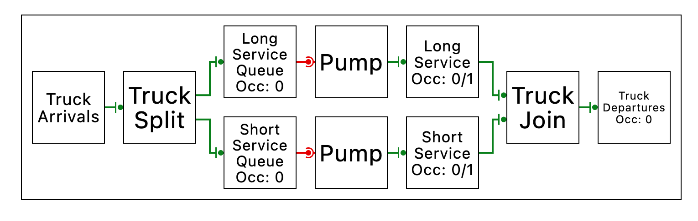
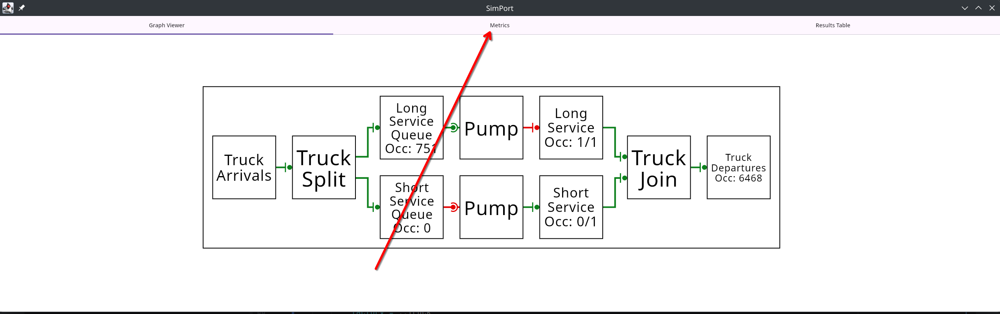

# Getting Started

## Quick start

We've made a template project that sets up the SimPort repository as a dependency.

Git clone the repository to get started.

```bash 
git clone https://github.com/PortSim/SimPort-Template.git
```

We recommend using IntelliJ for development, but you can also use gradlew to build and run the application.

```bash
cd SimPort-Template
./gradlew run 
```

Using the template, we've created a tutorial project with each tutorial as a commit. To follow along with the tutorial, run

```bash
git clone https://github.com/PortSim/SimPort-Tutorial.git
git checkout ":/01-getting-started"
```

Use gradlew to run the tutorial.

```bash
cd SimPort-Tutorial 
./gradlew run 
```

## Defining a port

First, let's define a basic port:

```kotlin
// This represents an object in our simulation
class Truck

fun examplePort(): Scenario = buildScenario {
    arrivals(
        label = "Truck Arrivals",
        generator = Generators.constant(
            // The generator makes a new Truck object each time, which is important so they can be tracked throughout
            // the network
            factory = ::Truck,
            // Trucks arrive on average every 4 minutes, following an exponential distribution
            Delays.exponentialWithMean(4.minutes),
        ),
    )
        // We split the trucks into 2 lanes; by default, the destination lane will be chosen randomly for each truck
        .thenFork(
            label = "Truck Split",
            lanes = listOf(
                { lane1 ->
                    // The first lane has the trucks queue for a long service
                    lane1.thenQueue(label = "Long Service Queue")
                        .thenService(label = "Long Service", Delays.exponentialWithMean(10.minutes))
                },
                { lane2 ->
                    // The second lane has the trucks queue for a short service
                    lane2.thenQueue(label = "Short Service Queue")
                        .thenService(label = "Short Service", Delays.exponentialWithMean(3.minutes))
                },
            )
        )
        // The trucks then merge back into 1 lane...
        .thenJoin(label = "Truck Join")
        // ...and leave the simulation
        .thenSink(label = "Truck Departures")
}.withMetrics {
    // Track the occupancy of each Queue
    trackAll<Queue<*>>(Occupancy)
}
```

This gives the following port layout:



which largely looks as we'd expect, except for the `Pump` nodes, which we will now discuss.

Connections between nodes are called "channels". We have two types of channels:

- Push channels are driven by the upstream node sending things downstream
- Pull channels are driven by the downstream node requesting things from upstream

|  |  |
|--------------------------------------------------------------|--------------------------------------------------------------|
| Push Channel Symbol                                          | Pull Channel Symbol                                          |

`Pump` nodes simply convert from a pull channel to a push channel, by repeatedly requesting items from its input and
sending them downstream. For convenience, they are inserted automatically when making a connection from a pull output to
a push input.

The inverse concept is a `Queue`, which converts from a push to a pull. Items are pushed into a queue and remain there
until the downstream requests them. `Queue`s are, by contrast, *not* inserted automatically, since we believe they
should be explicit.

## Running a simulation

```kotlin
fun main() {
    // Option 1: Run a simulation for a set duration and inspect its results
    runSimulation(examplePort(), 20.days)

    // Option 2: Run the simulation live in the GUI and see results as they happen
    runLiveSimulation(examplePort())
}
```

## Looking at the metrics

At the top of the screen, there's a metrics tab which displays the occupancy of each node, mean occupancy over time, and
a confidence interval of the mean.

